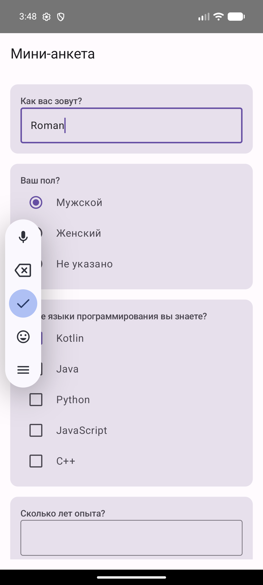

# Otus AI — Мини-анкета

Kotlin Multiplatform проект: backend (Ktor) + Android (Jetpack Compose).

## Требования

- JDK 17+
- Android SDK (platform 34, build-tools 34+)
- Android эмулятор или устройство

## Запуск backend

```bash
./gradlew :service:run
```

Сервер запустится на `http://localhost:8080`.
Доступные endpoints: `GET /questions`, `POST /answers`.

## Запуск Android приложения

```bash
./gradlew :android:installDebug
```

Приложение подключается к backend по адресу `http://10.0.2.2:8080` (стандартный alias эмулятора для localhost).

## Скриншоты

| Экран анкеты | Экран после отправки |
|---|---|
|  |  |
